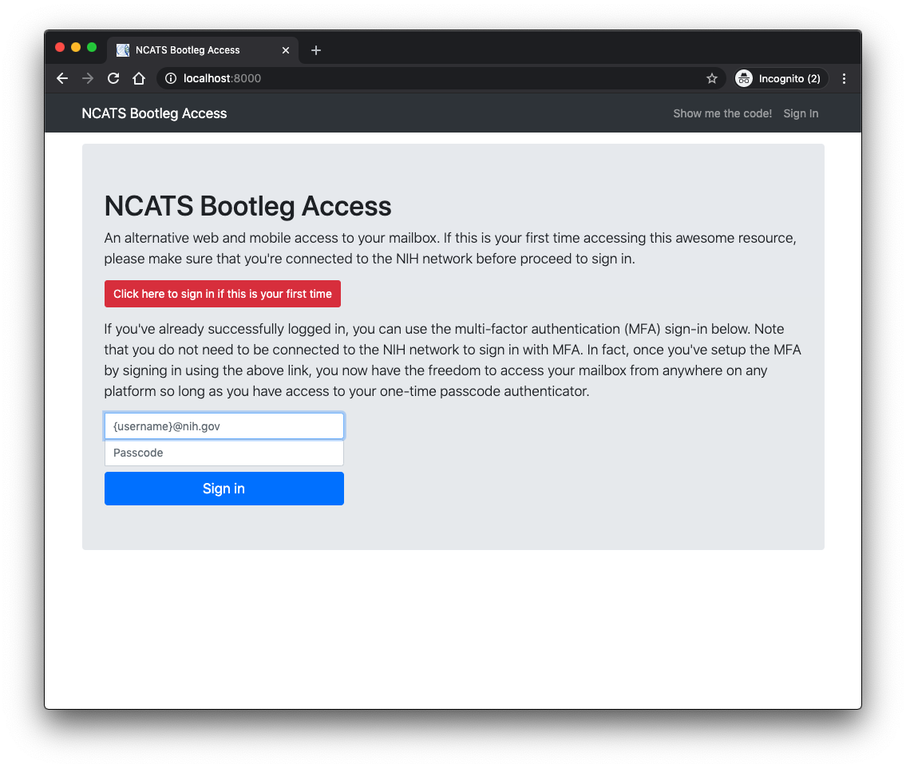

This is a django repository to interact with the Microsoft Graph. The
following packages are required to run this code:

```
python 3+
django 3+
pyotp
pytz
python-dateutil
oauthlib
requests
requests-oauthlib
```

To build

```
python manage.py makemigrations bootleg
python manage.py migrate
```

Before running the code, make sure to (i) edit the file `oauth_settings_example.yml` as appropriate
and rename it as `oauth_settings.yml` and (ii) if necessary adjust `settings.py` for deployment other 
than `localhost`. Please see documentations on 
[Microsoft Graph](https://developer.microsoft.com/en-us/graph/get-started/python) for additional details.

```
python manage.py runserver
```

Then point your browser to
[http://localhost:8000](http://localhost:8000) and you should see
something like the following screenshot:



Once you've successfully authenticated, you should be presented with a
screen with an QR code as shown here:


Now you should be able to scan the QR code with your mobile phone and
have the account added to your authenticator app. You can start
browsing your messages.


You will be required to enter the rotating one-time passcode every
hour as you interact with the app. Drop
[me](mailto:nguyenda@mail.nih.gov) an email if you have any problems
setting this up!


